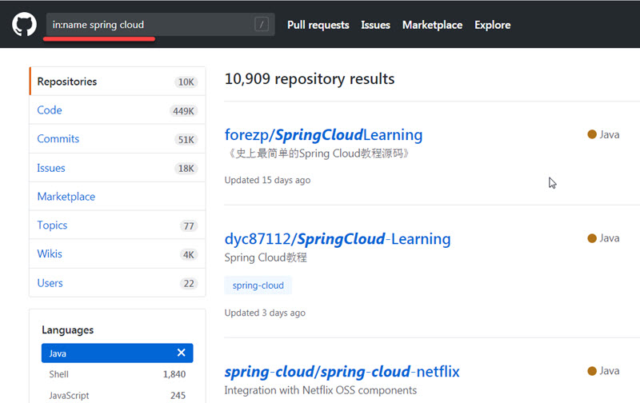
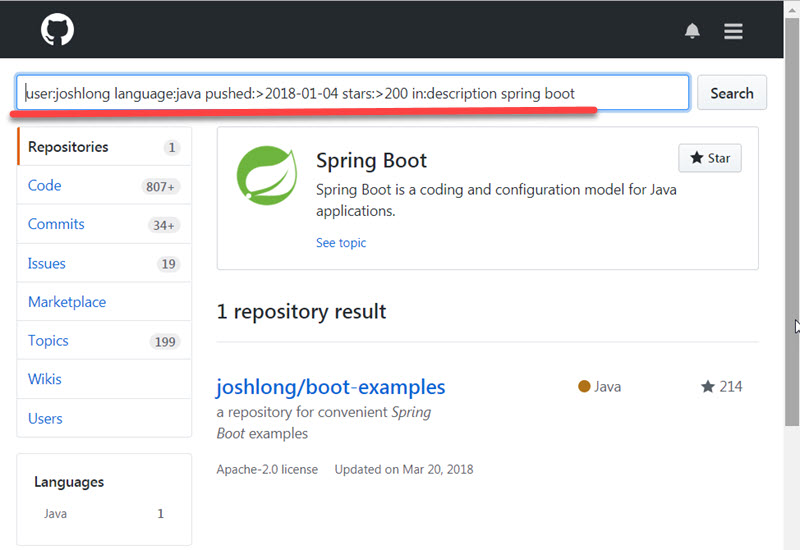
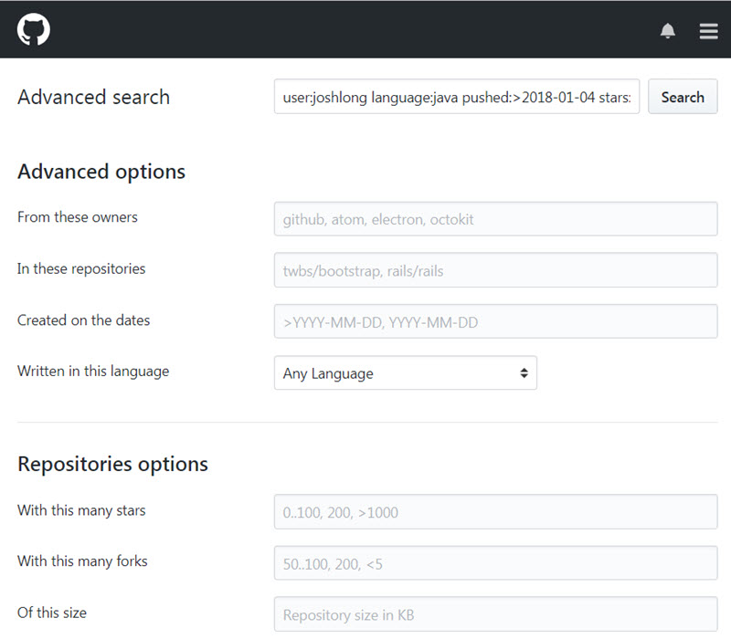

You search on Google every day, and as a programmer, you would probably search on GitHub every day. Are you sure you know how to search GitHub repositories effectively? Let's check out these 7 tips you probably didn't know.

<!-- more -->

### 1. In Name, In Description, and In README

GitHub supports advance search in a certain field, like repository title, description, and README.

For example, you want to find some cool repository to learn Spring Cloud stuff, you can search like this:

`in:name spring cloud`

In the same way, you can also search in description or README only:

`in:description spring cloud`
`in:readme spring cloud`

### 2. More Stars, More Forks

Stars of a repository would provide information on how popular it is, which is an important metrics in consideration, as a result, you can search like this:

`stars:>=3000 spring cloud`

You can also define a range like this:

`forks:10..20 spring cloud`

### 3. Small Repositories Please

Dinosaur repositories are not what you want, you love those simple, small and smart repositories only, you can add this search term:

`size:<=5000 spring cloud`

Unit of size here is KB, so 5000 means 5MB.

### 4. Actively Maintained Repositories Please

Most of the time you don't want to rely on a project that didn't update for 7 years, actively maintained projects would give you more confidence, thus you need to introduce last push time in your search term. For example, you want to search those projects have updates in the last two weeks:

`pushed:>2019-01-04 spring cloud`

You may also search repositories created before or after a certain time using `created` rather than `push`.

### 5. Apache License Please

License of open source projects might bring you much trouble, you remember Facebook and React, right? If you want to search projects friendly licensed, for example, the well known Apache License 2, you would search like this:

`license:apache-2.0 spring cloud`

Of course, you can hunt other licenses also, just search in the [complete list](https://help.github.com/articles/licensing-a-repository/) provided by GitHub and choose the one you love.

### 6. Java Only

`language:java` will filter repositories not written in Java, yeah! If you hate Java then replace it with the one you love, for example, the best programming language PHP.

### 7. Rock Star Only

You may just want to search repositories by a Rock Star or a well-known organization because they are more likely awesome, just include `user` in your search term like this:

`user:joshlong spring cloud`
`org:spring-cloud spring cloud`

Obviously, you can combine the 7 tips together for more complex search, for example:

`user:joshlong language:java pushed:>2018-03-04 stars:>200 in:description spring boot`

### More Options to Explore

Want to explore all possible search terms? Just play around with ["Advanced Search"](https://github.com/search/advanced) or read the ["search help"](https://help.github.com/articles/about-searching-on-github/) by GitHub, the time you spent there will be definitely worthy.

**Happy Hunting!**

_PS:_ If you are a Chinese reader you would like to read the original version by Shucheng Hou at [here](https://mp.weixin.qq.com/s/__MXKPICzAL4mLetycfc9A). My post is a simplified and slightly modified English version actually.

