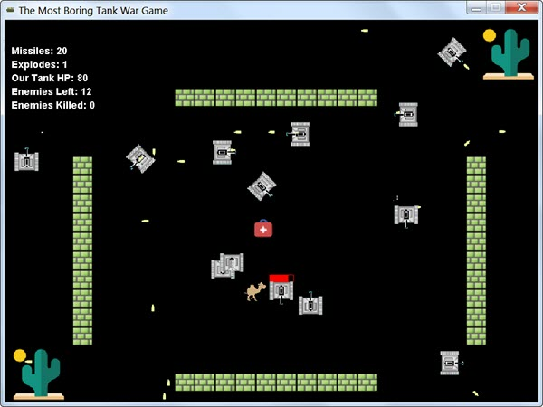
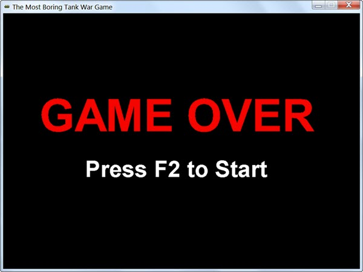

I've just published a mid-term project for a small group of students. If you are a Java beginner who is seeking some challenge to conquer, I believe this [Tank War](https://github.com/nateyoung427/tankwar) game would be fit for you. Wanna a try?😄 Solution for your reference will be released after 3 weeks.

<!-- more -->

I wrote my first line of Java code, the famous "Hello World" at 26. It was 2009 and life is really tough for me, all my hope is to finish the coding camp program as soon as possible and start working as a programmer to earn some livings. This little game was the final project of JavaSE course and I just cannot figure out it myself, only by following the instructor's patient explanations I can catch up with what he is actually doing at that time. I don't remember how many hours I spent on this little, stupid, and boring game, but I would never forget this painful experience.

And this time, when I told the students that they need to finish this in 3 weeks, half of them silenced, I know that feeling very well - they have no idea what to do, just like me 10 years ago. Maybe they don't know, less than 450 lines of code will be sufficient for the implementations. Unreasonable fear would just make you ignoring many obvious and clear facts.

One would easily choose "Game Over", and rarely press F2 to restart.

At that time, I was upset, depressed and anxious, but with patience and sweat, I finally finished the 3 months program and fortunately found a job to begin my career as a programmer. 10 years later, it has been very clear to me that I don't have much talent in this area, but it doesn't mean that I cannot leverage my skills to make a difference and help others - which I've actually done these years.

Yes, not everyone can be a great programmer, but everyone can be a programmer and make a difference - if they really want and devote themselves to it.

Set up a challenging goal, and achieve it by all means - I firmly believe this is the most efficient way to improve your programming skills. So do not fear, do not hesitate.

And, **JUST DO IT!**

