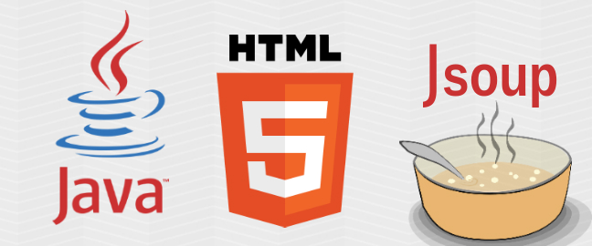

[Jsoup](https://github.com/jhy/jsoup/) would probably be the most popular "working with real-world HTML" library in the Java community. I've been using it for web crawler stuff since _1.7.3_(latest release is _1.11.3_), but a little bit surprised to see that there is little introduction or analysis regarding its source code and implementations.

<!-- more -->

Since I will use Jsoup as an example for [OOP course(SE500)](http://oit.olivetuniversity.edu/academics/macourses.htm) I would teach at [Olivet Institute of Technology](http://oit.olivetuniversity.edu/) from Jan 2019, I tried to summarize the most important ideas behind-the-scene so that at least I know what I will talk about.😅These series were inspired from [jsoup-learning](https://github.com/code4craft/jsoup-learning) and reused some graphs from it. Many thanks for [Yihua Huang](https://github.com/code4craft)'s digging into this beautiful library.

This is the first part of the series. I will give a brief introduction about features of Jsoup and its general code structure. After that, I will analyze the DOM parser and CSS selector implementation mechanism, plus with some interesting tips and tricks in following articles.

Jsoup is developed by [Jonathan Hedley](https://jhy.io/), a Senior Manager of Software Development at Amazon. According to the [change logs](https://github.com/jhy/jsoup/blob/master/CHANGES), the initial beta was released at Jan 31, 2010, so it has been about **9 years** till now! He is still maintaining the code base regularly, though not that actively as before. It might be due to "jsoup is in general, stable release" as he said.

I use the latest version _1.12.1-SNAPSHOT_ for these series. It's a [Maven](https://maven.apache.org/) project without any external dependencies, though it introduced junit, gson, and jetty for unit test and integration test usage. According to the statistic result of [cloc](https://github.com/AlDanial/cloc), there are **68** Java source files under `src\main\java`, **12015** lines of code, **4177** lines of comment and **1991** blank lines. As a library with good test coverage, there are **46** Java source files under `src\test\java`, with **7911** lines of code, **350** lines of comment and **1672** blank lines.

The percentage of test code against production code is **65.8%**, which is pretty good. As for test coverage, Intellij IDEA code coverage runner gives the report in the below, which is also impressive.

| Package  | Class, %  | Method, %  | Line, %  |
|---|---|---|---|
| org.jsoup | 98% (229/233) | 87% (1269/1457) | 83% (6135/7317) |
| org.jsoup.helper | 100% (11/11) | 79% (138/174) | 83% (692/824) |
| org.jsoup.internal | 100% (3/3) | 100% (27/27) | 95% (141/147) |
| org.jsoup.nodes | 96% (31/32) | 87% (356/407) | 88% (1286/1455) |
| org.jsoup.parser | 100% (114/114) | 91% (490/535) | 79% (2924/3699) |
| org.jsoup.safety | 100% (9/9) | 100% (44/44) | 95% (286/300) |
| org.jsoup.select | 100% (58/58) | 81% (193/237) | 92% (772/836) |

You may find that package `org.jsoup.examples` is missing here. Since it is used as a showcase, it's reasonable that there is no need to write tests against them, thus I exclude it. It might be better to remove them out of production code and extract to another project with more examples covering most frequent scenarios - just in my opinion.

As a widely used library aiming at "working with real-world HTML", the higher the test coverage is, the better. I've heard that Evan You, author of [Vue.js](https://github.com/vuejs), even achieved 100% unit test coverage! 669 test cases make sure Jsoup stay at good status - but this still cannot prevent new issues happen. Anyway, real-world is always a crazy world, go to the test cases and you will believe what I said. For example, `<p =a>One<a <p>Something</p>Else`, `<div id=1<p id='2'`, what the hack is this? what should be the expected correct parsing result? Can you figure them out in 5 seconds?😭

Even though Jsoup is well covered by unit tests and maintains a high quality of implementation, you still need to be very careful when you prepare to upgrade to a new version - actually this is something to be self-evident - you just need more and more test cases to make your life easier. I remember very clearly in Dec 2016, some of my unit tests suddenly failed after I upgraded from _1.8.3_ to _1.10.1_ without doing anything else. Since my software was used by thousands of clients, I immediately report an [issue](https://github.com/jhy/jsoup/issues/803) in Github and rollback to 1.8.3 for a while, I just can't imagine what will happen if I simply upgrade it, you know, some bugs just appear in certain circumstances and not easy to reproduce in normal functional tests.

From the test coverage result, you will also get a whole picture of code structure. While jsoup providing convenient methods to submit HTTP requests and get responses, the most important parts are still under package `org.jsoup.parse` and `org.jsoup.select`. I will introduce them in the 2nd and 3rd articles of these series. The 5 lines of code in the below, covering most frequently used scenarios, are fairly clean, easy and simple, which only means Jsoup did quite a good job for its API user experience.

```java
Document doc = Jsoup.connect("https://en.wikipedia.org").get();
Elements newsHeadlines = doc.select("#mp-itn b a");
for (Element headline : newsHeadlines) {
    log("%s\n\t%s", headline.attr("title"), headline.absUrl("href"));
}
```

Jsoup also provides a website for you to play around with its [selector](https://jsoup.org/apidocs/org/jsoup/select/Selector.html). [Try Jsoup](https://try.jsoup.org/) is the place where you can explore features of Jsoup without writing one line of code. It is also created for issue report. You can save the input, parameters, and output so that those who want to help you will go to the point much faster. For example, I want to retrieve all the post titles of Old Young Boys Club: http://try.jsoup.org/~iZFlhTQQAZnkXoPSCKrG4OisFcg. The upgrade issue I mentioned above also had a corresponding session link http://try.jsoup.org/~NOfOU7vXHAaHWhDnHv5qBIPtE1M still available today.👍

After you get familiar with the features of Jsoup, it's time to go to source code to understand the mechanism. I would suggest you run class `org.jsoup.examples.Wikipedia` and debug the 5 lines of code above to see what actually happened step by step. Beware, it's a long journey. If you get stuck you may also go over the test cases to understand what kind of problems the code will resolve - and how you would resolve. It's also helpful to fork the repository and try to submit some pull requests, you may either pick up an issue and try to fix or make some minor enhancements. Actually, I just submitted Pull Requests [#1157](https://github.com/jhy/jsoup/pull/1157) and [#1158](https://github.com/jhy/jsoup/pull/1158) yesterday plus two issues: [#1156](https://github.com/jhy/jsoup/issues/1156) and [#1159](https://github.com/jhy/jsoup/issues/1159). I hope Jonathan would accept my PR and consider fixing these issues.😅

PS: Once there was a Japanese Samurai who submitted a Pull Request [#564](https://github.com/jhy/jsoup/pull/564) at Apr 27, 2015, got approved and merged at Nov 19, 2017. He recorded this unforgettable experience in twitter.

<blockquote class="twitter-tweet tw-align-center" data-lang="en"><p lang="en" dir="ltr">Thanks -- better late than never :)</p>&mdash; Jonathan Hedley (@jhy) <a href="https://twitter.com/jhy/status/932505536662183936?ref_src=twsrc%5Etfw">November 20, 2017</a></blockquote>
<script async src="https://platform.twitter.com/widgets.js" charset="utf-8"></script>

**-To Be Continued-**